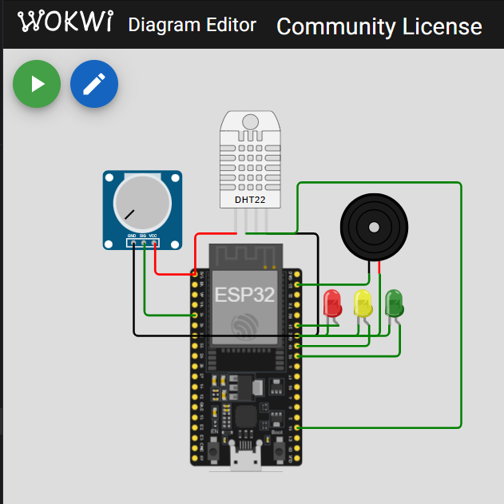
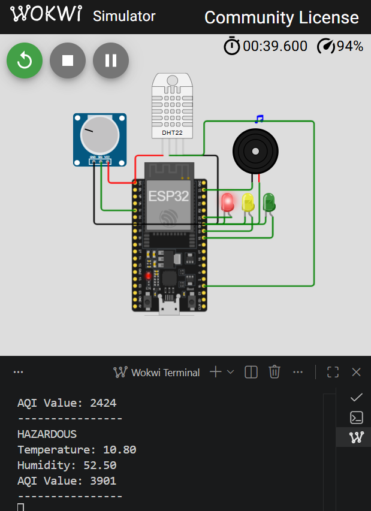
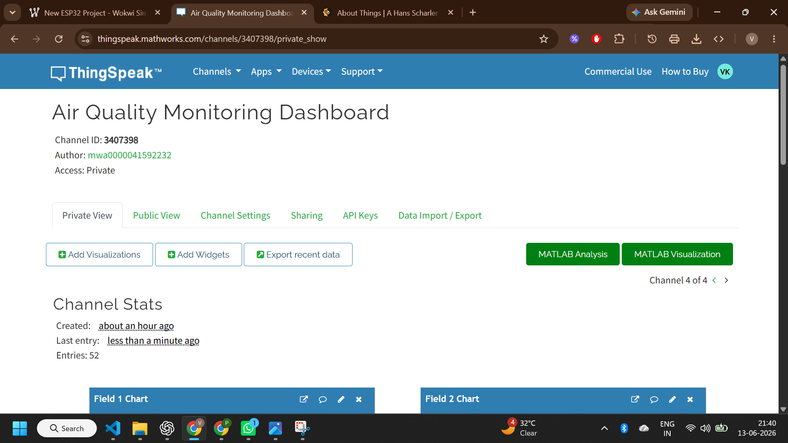
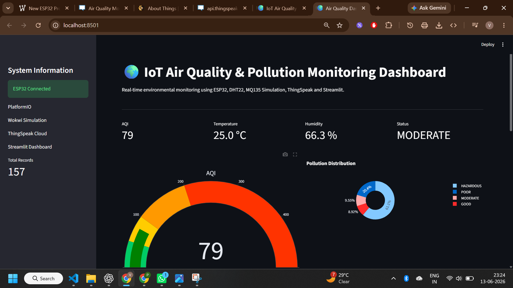

# 🌍 IoT Air Quality & Pollution Monitoring Dashboard

## Live Demo

Streamlit Dashboard:
https://your-app-name.streamlit.app

## 📌 Overview

The **IoT Air Quality & Pollution Monitoring Dashboard** is a real-time environmental monitoring system developed using **ESP32**, **DHT22**, **MQ135 Simulation**, **ThingSpeak**, and **Streamlit**.

The system continuously monitors environmental conditions, calculates Air Quality Index (AQI) levels, classifies pollution severity, generates alerts, stores historical data, and visualizes information through both a cloud dashboard and a custom analytics dashboard.

This project demonstrates IoT device integration, sensor monitoring, cloud connectivity, data analytics, and dashboard development in a single end-to-end solution.

---

# 🎯 Problem Statement

Air pollution is one of the most significant environmental challenges worldwide. Traditional monitoring systems are often expensive and difficult to deploy at scale.

This project provides a low-cost IoT solution capable of:

* Monitoring air quality in real time
* Detecting pollution severity
* Alerting users about hazardous conditions
* Logging environmental data
* Visualizing trends through dashboards

---
# 🚀 Features

### Environmental Monitoring

* Air Quality Monitoring
* Temperature Monitoring
* Humidity Monitoring
* AQI Classification

### Alert System

* Green LED for Good Air Quality
* Yellow LED for Moderate Air Quality
* Red LED for Hazardous Air Quality
* Buzzer Alert for Dangerous Conditions

### Cloud Integration

* ThingSpeak Dashboard
* Real-Time Data Upload
* Historical Data Storage

### Analytics

* CSV Data Logging
* AQI Trend Analysis
* Temperature Trend Analysis
* Humidity Trend Analysis

### Dashboard

* Streamlit Web Dashboard
* AQI Gauge Visualization
* KPI Cards
* Pollution Distribution Analysis
* Interactive Charts

---

# 🛠 Tech Stack

## Hardware

* ESP32 Dev Board
* DHT22 Sensor
* MQ135 Simulation (Potentiometer)
* LEDs
* Buzzer

## Software

* Arduino Framework
* PlatformIO
* Wokwi Simulator
* Python
* Streamlit
* Pandas
* Plotly
* ThingSpeak

---

# 🏗 System Architecture

```text
DHT22 Sensor
      │
      ▼
MQ135 Simulation
      │
      ▼
ESP32 Controller
      │
      ▼
AQI Classification Logic
      │
 ┌────┴────┐
 ▼         ▼
LEDs     Buzzer
Alerts   Alert
      │
      ▼
Python Logger
      │
      ▼
ThingSpeak Cloud
      │
      ▼
Streamlit Dashboard
```

---

# 📊 AQI Classification

| AQI Range | Category  |
| --------- | --------- |
| 0 - 50    | Good      |
| 51 - 100  | Moderate  |
| 101 - 200 | Poor      |
| 201 - 500 | Hazardous |

---

# 🔌 Hardware Connections

## DHT22

| DHT22 Pin | ESP32 Pin |
| --------- | --------- |
| VCC       | 3V3       |
| GND       | GND       |
| DATA      | GPIO15    |

---

## MQ135 Simulation (Potentiometer)

| Potentiometer Pin | ESP32 Pin |
| ----------------- | --------- |
| VCC               | 3V3       |
| GND               | GND       |
| SIG               | GPIO34    |

---

## LEDs

| LED    | GPIO   |
| ------ | ------ |
| Green  | GPIO18 |
| Yellow | GPIO19 |
| Red    | GPIO21 |

---

## Buzzer

| Component | GPIO   |
| --------- | ------ |
| Buzzer    | GPIO23 |

---

# 📁 Project Structure

```text
IoT-Air-Quality-Pollution-Monitoring-Dashboard
│
├── src/
│   └── main.cpp
│
├── dashboard/
│   └── app.py
│
├── python_simulation/
│   └── thingspeak_logger.py
│
├── data/
│   └── air_quality_log.csv
│
├── images/
│
├── outputs/
│
├── reports/
│
├── docs/
│
├── circuit_diagram/
│
├── platformio.ini
├── diagram.json
├── wokwi.toml
├── requirements.txt
├── .gitignore
└── README.md
```

---

# ⚙ Installation

## Clone Repository

```bash
git clone https://github.com/yourusername/IoT-Air-Quality-Pollution-Monitoring-Dashboard.git

cd IoT-Air-Quality-Pollution-Monitoring-Dashboard
```

---

## Install Dependencies

```bash
pip install -r requirements.txt
```

---

## Run ESP32 Simulation

Build the project using PlatformIO:

```bash
pio run
```

Start Wokwi Simulation:

```bash
Ctrl + Shift + P

Wokwi: Start Simulator
```

---

## Run Data Logger

```bash
python python_simulation/thingspeak_logger.py
```

---

## Run Dashboard

```bash
streamlit run dashboard/app.py
```

---

# ☁ ThingSpeak Integration

The project uploads environmental data to ThingSpeak including:

* AQI
* Temperature
* Humidity
* Pollution Status
* Alert Status

ThingSpeak provides:

* Real-Time Monitoring
* Historical Data
* Cloud Storage
* Graph Visualization

---

# 📈 Dashboard Features

The Streamlit Dashboard provides:

* AQI Gauge
* AQI Trend Chart
* Temperature Trend Chart
* Humidity Trend Chart
* Pollution Distribution Chart
* Recent Sensor Readings
* Live KPI Metrics

---

# 📸 Screenshots

Add screenshots here:

## Circuit Diagram



## Wokwi Simulation



## ThingSpeak Dashboard



## Streamlit Dashboard



---

# 🌍 Applications

* Smart Cities
* Environmental Monitoring
* Industrial Safety
* Smart Homes
* Schools and Colleges
* Hospitals
* Research Projects

---

# 🔮 Future Improvements

* Real MQ135 Sensor Integration
* MQTT Communication
* Mobile App Support
* Email Alerts
* SMS Notifications
* GPS-Based Pollution Mapping
* Machine Learning-Based AQI Prediction
* Multi-Sensor Monitoring

---

# 🎓 Learning Outcomes

This project demonstrates:

* IoT System Design
* ESP32 Programming
* Sensor Interfacing
* AQI Computation
* Cloud Integration
* Dashboard Development
* Data Analytics
* Environmental Monitoring
* PlatformIO Development
* GitHub Project Management

---

# 👨‍💻 Author

**Varda Kunde**

B.Tech CSE (AI & ML)

DIEMS

---

# 📜 License

This project is intended for educational and learning purposes.
